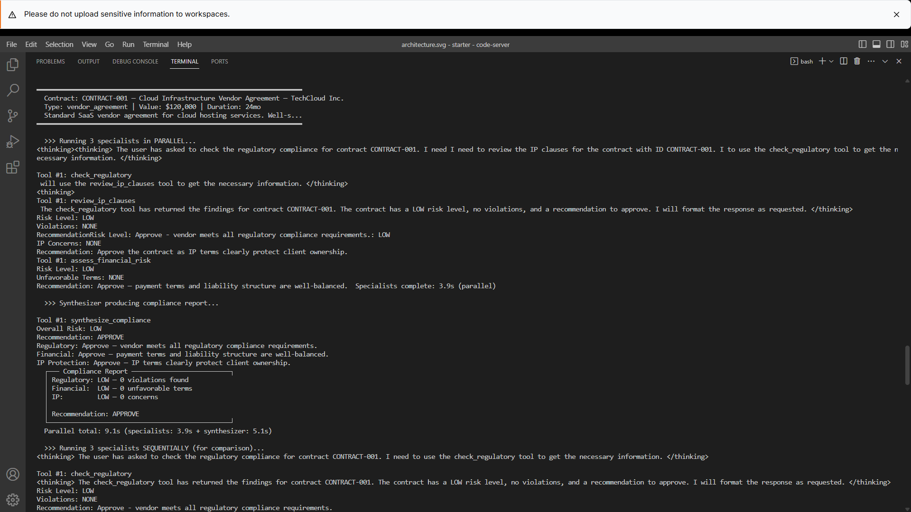
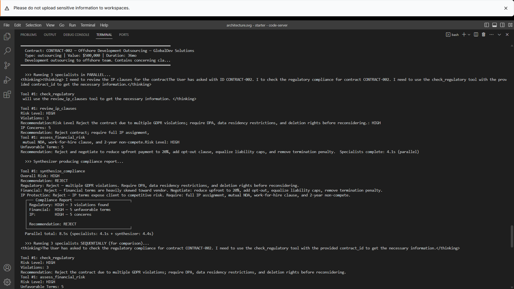
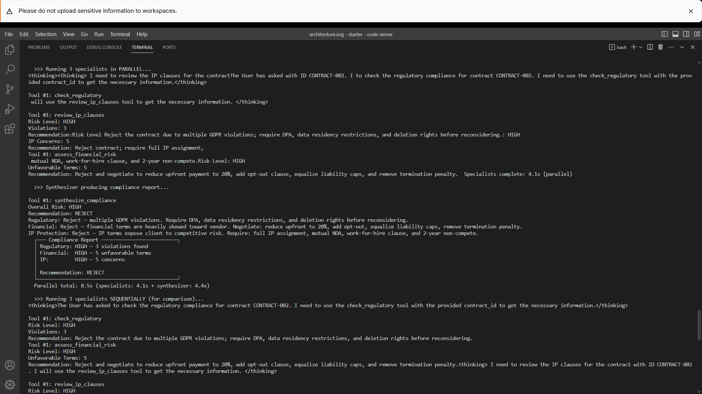
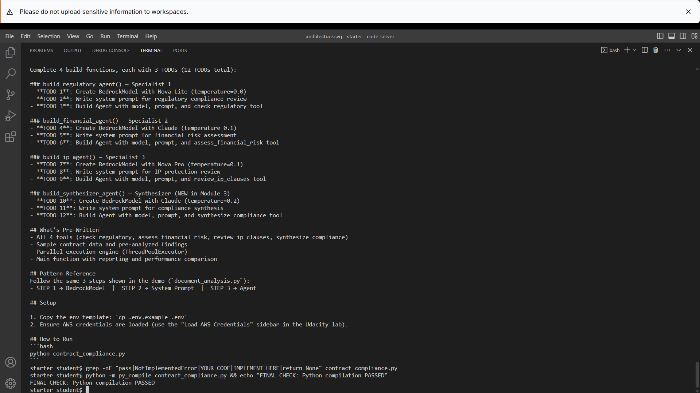

# AWS Parallel Contract Compliance Agents

A multi-agent contract compliance analysis system built with **Amazon Bedrock**, **Strands Agents**, and **Python**. The system demonstrates an agentic parallelization workflow in which independent specialist agents analyze different dimensions of a contract concurrently before a synthesizer agent combines their findings into a single compliance recommendation.

## Overview

Contract review often requires several independent forms of analysis, including regulatory compliance, financial risk assessment, and intellectual property review. Performing these tasks sequentially can increase processing time even when the individual analyses do not depend on one another.

This project implements a **parallel multi-agent architecture** that assigns each review domain to a dedicated AI agent. The specialist agents execute concurrently using Python's `ThreadPoolExecutor`, after which a synthesizer agent consolidates their findings into a final compliance report.

The project demonstrates how agentic AI systems can use parallelization to reduce end-to-end execution time for workloads containing independent tasks.

## Architecture


The workflow follows a **fan-out / fan-in** pattern:

```text
                         Contract
                            |
             +--------------+--------------+
             |              |              |
             v              v              v
       Regulatory       Financial          IP
         Agent            Agent           Agent
             |              |              |
             +--------------+--------------+
                            |
                            v
                    Synthesizer Agent
                            |
                            v
                 Compliance Recommendation
```

## Execution Results

The multi-agent workflow was tested against contracts with different risk profiles to verify that the specialist agents could execute independently, synthesize their findings, and produce an appropriate compliance recommendation.

### Low-Risk Contract Analysis

The system successfully evaluated a low-risk cloud infrastructure vendor agreement. The Regulatory, Financial Risk, and IP Protection agents independently returned low-risk findings before the Synthesizer Agent consolidated the results into an **APPROVE** recommendation.



### High-Risk Contract Analysis

The workflow was also tested against a higher-risk offshore development outsourcing contract. The specialist agents identified regulatory violations, unfavorable financial terms, and intellectual property concerns. The Synthesizer Agent consolidated these findings and produced a **REJECT** recommendation.



### Parallel Agent Execution

The three specialist agents execute concurrently using Python's `ThreadPoolExecutor`. Once all three analyses are complete, their findings are passed to the Synthesizer Agent for the final compliance assessment.



### Final Validation

The completed implementation was checked for unfinished placeholders and validated using Python compilation.



The final validation completed successfully, confirming that the Python implementation compiles without syntax errors.

## Author

**Ayomikun Adaramola**

Senior Data Engineer | AI & Cloud Engineering | Agentic AI

Developed as part of the **Udacity AWS Future Agentic AI Engineer Nanodegree**.
