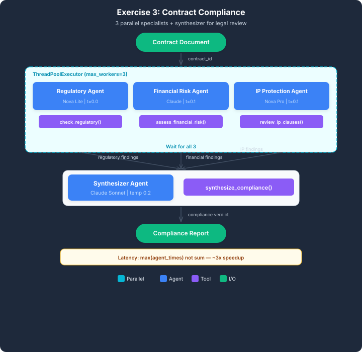

# AWS Parallel Contract Compliance Agents

A multi-agent contract compliance analysis system built with **Amazon Bedrock**, **Strands Agents**, and **Python**. The system demonstrates an agentic parallelization workflow in which independent specialist agents analyze different dimensions of a contract concurrently before a synthesizer agent combines their findings into a single compliance recommendation.

## Overview

Contract review often requires several independent forms of analysis, including regulatory compliance, financial risk assessment, and intellectual property review. Performing these tasks sequentially can increase processing time even when the individual analyses do not depend on one another.

This project implements a **parallel multi-agent architecture** that assigns each review domain to a dedicated AI agent. The specialist agents execute concurrently using Python's `ThreadPoolExecutor`, after which a synthesizer agent consolidates their findings into a final compliance report.

The project demonstrates how agentic AI systems can use parallelization to reduce end-to-end execution time for workloads containing independent tasks.

## Architecture



The workflow follows a **fan-out / fan-in** pattern:

```text
                         Contract
                            |
             +--------------+--------------+
             |              |              |
             v              v              v
       Regulatory       Financial          IP
         Agent            Agent           Agent
             |              |              |
             +--------------+--------------+
                            |
                            v
                    Synthesizer Agent
                            |
                            v
                 Compliance Recommendation

## Author

**Ayomikun Adaramola**

Senior Data Engineer | AI & Cloud Engineering | Agentic AI

Developed as part of the **Udacity AWS Future Agentic AI Engineer Nanodegree**.
